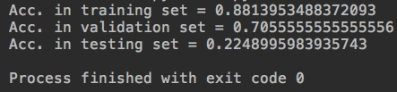
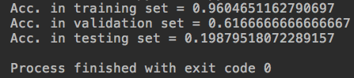
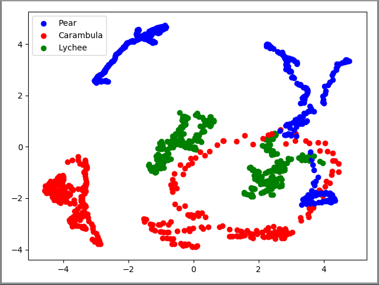
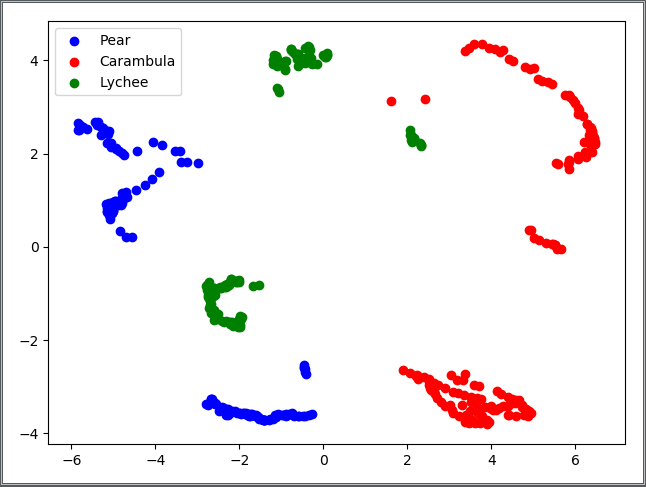
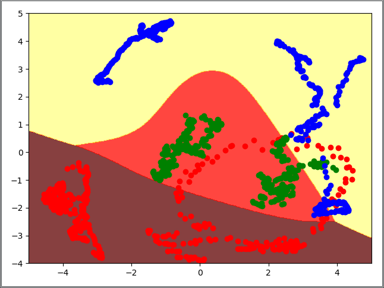
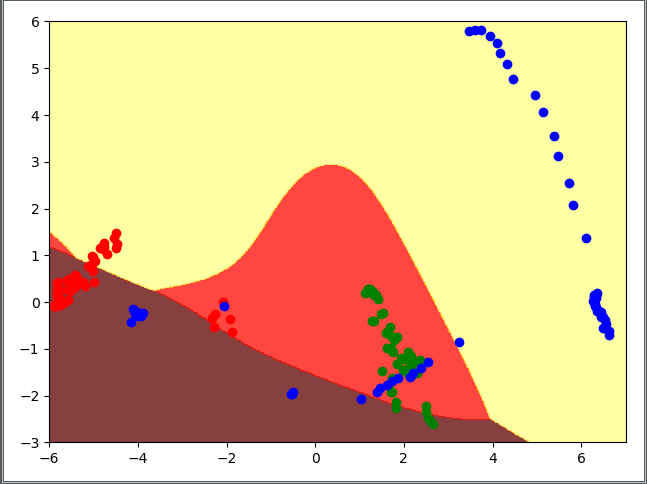
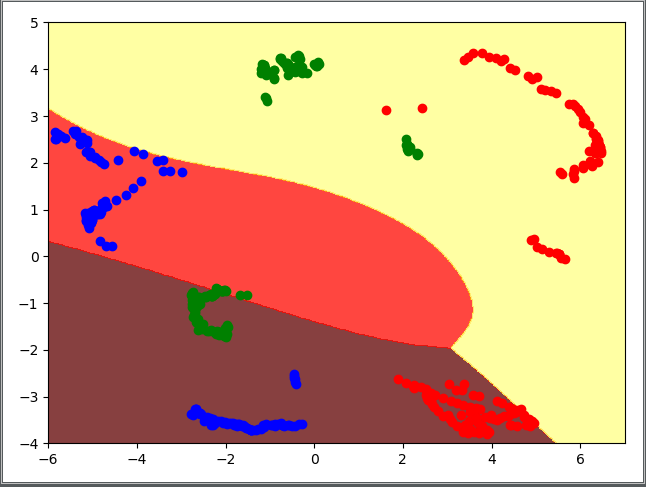
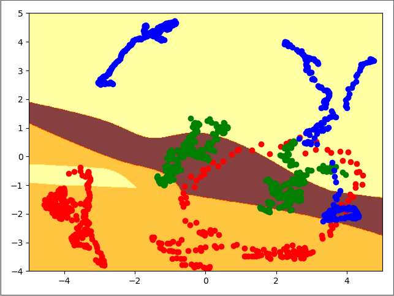
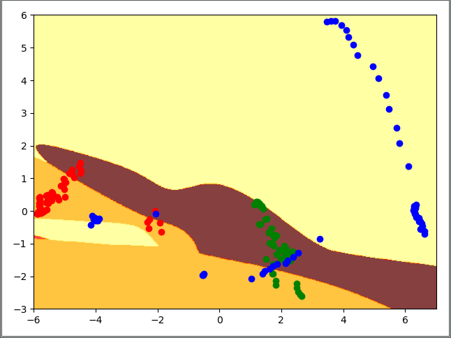
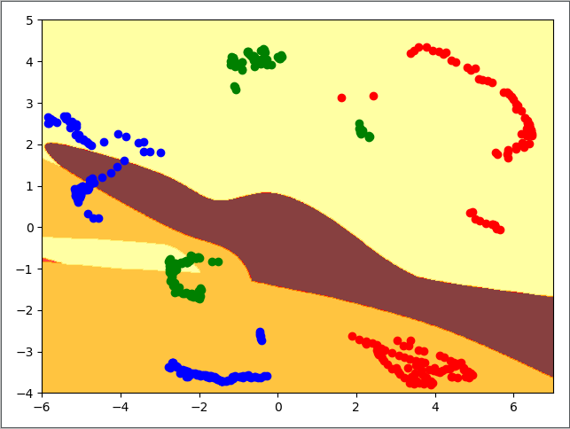

# Homework 3
* Name: 陳冠弘
* ID: 105061171

## Overview
In this homework, we need to first use PCA to map the images down to 2 dimensions, then use a two (or three) layer network to predict the classification.

## Implementation
### Prepare data
* IMPORTANT: I split the origin training set into training and validation set. Specifically, the last 60 images in each class in the training set will be in validation set. 
* We do the dimension reduction by using PCA. (in ```dataset.py```)
```python
class Dataset(torch.utils.data.Dataset):
    .
    .
    .
    def _pca(self, img_paths):
        pca = PCA(n_components=2)
        data = []
        for img_path in img_paths:
            img = Image.open(img_path)
            img = np.asarray(img)[:, :, 0]
            img = np.true_divide(img, 255)
            img = np.reshape(img, (1, -1))
            try:
                data = np.concatenate((data, img), axis=0)
            except ValueError:
                data = img
        pca_data = pca.fit_transform(data)
        return pca_data
```
### Model structure
* We build a two layer network for prediction. (in ```model.py```)
```python
class Two_Layer_Classifier(object):
    .
    .
    .
    def forward(self, x):
        bias = 1
        x = np.append(x, bias)

        z1 = np.dot(x, self.param['W1']) + self.param['b1']
        a1 = self.sigmoid(z1)
        z2 = np.dot(a1, self.param['W2']) + self.param['b2']
        output = self.softmax(z2)

        self.ch['x'] = x
        self.ch['Z1'] = z1
        self.ch['A1'] = a1
        self.ch['Z2'] = z2
        self.ch['output'] = output

        return output
```
### Loss function
* For training the network, I choose the Cross-entropy as the loss function. (in ```model.py```)
```python
class Two_Layer_Classifier(object):
    .
    .
    .
    def loss(self, logits, label):
        y = np.zeros(3)
        y[label] = 1
        cross_entropy = np.sum(y[i] * np.log10(logits[i]) + (1-y[i]) * np.log10(1-logits[i]) for i in range(len(logits)))
        cross_entropy = - cross_entropy / len(logits)
        self._label = y
        return cross_entropy
```
### Backpropagation
* We calculate the gradients to update the weights by backpropagation. (in ```model.py```)
```python
class Two_Layer_Classifier(object):
    .
    .
    .
    def backward(self):
        dLoss_Y = -(self._label / self.ch['output'] - (1.0 - self._label) / (1.0 - self.ch['output']))
        dY_Z2 = np.array([(np.exp(self.ch['Z2'][0]) * (np.exp(self.ch['Z2'][1]) + np.exp(self.ch['Z2'][2]))) / ((np.sum(np.exp(self.ch['Z2']))) ** 2),
                 (np.exp(self.ch['Z2'][1]) * (np.exp(self.ch['Z2'][0]) + np.exp(self.ch['Z2'][2]))) / ((np.sum(np.exp(self.ch['Z2']))) ** 2),
                 (np.exp(self.ch['Z2'][2]) * (np.exp(self.ch['Z2'][0]) + np.exp(self.ch['Z2'][1]))) / ((np.sum(np.exp(self.ch['Z2']))) ** 2)])
        dZ2_A1 = self.param['W2']
        dA1_Z1 = self.sigmoid(self.ch['Z1']) * (1.0 - self.sigmoid(self.ch['Z1']))
        dZ1_W1 = np.asarray(self.ch['x'])
        dZ2_W2 = self.ch['A1']

        dLoss_Z2 = dLoss_Y * dY_Z2  # (3,)
        dLoss_A1 = np.dot(dZ2_A1, dLoss_Z2)
        dLoss_Z1 = dLoss_A1 * dA1_Z1
        dLoss_W1 = np.reshape(dZ1_W1, (-1, 1)) * np.reshape(dLoss_Z1, (1, -1))
        dLoss_W2 = np.reshape(dZ2_W2, (-1, 1)) * np.reshape(dLoss_Z2, (1, -1))
        dLoss_b1 = dLoss_Z1 * 1
        dLoss_b2 = dLoss_Z2 * 1

        self.param['W1'] = self.param['W1'] - self.lr * dLoss_W1
        self.param['b1'] = self.param['b1'] - self.lr * dLoss_b1
        self.param['W2'] = self.param['W2'] - self.lr * dLoss_W2
        self.param['b2'] = self.param['b2'] - self.lr * dLoss_b2
```
### Extra functions
* I write the weight-saving and weight-loading functions for convenience. (in ```model.py```)
```python
class Two_Layer_Classifier(object):
    .
    .
    .
    def save_weight(self):
        try:
            filename = 'weight_two_layer_' + str(len(glob.glob(os.path.join('weights', 'two_layer', '*.pkl')))) + '.pkl'
            with open(os.path.join('weights', 'two_layer', filename), 'wb') as f:
                pickle.dump(self.param, f, pickle.HIGHEST_PROTOCOL)
        except:
            print('Saving weights failed.')

    def load_weight(self, path):
        try:
            with open(path, 'rb') as f:
                self.param = pickle.load(f)
        except FileNotFoundError:
            raise FileNotFoundError('Path to weight does not exist.')
```
### Training procedure
* We feed forward the PCA'ed data into model, then calculate loss and do backpropagation. (in ```train.py```)
* Notice that I use patience to decide when to stop training.
```python
def train(path_to_data_dir):
    .
    .
    .
    model = Two_Layer_Classifier(hidden_num=6, lr=0.001)
    step = 0
    best_val_loss = 100
    patience = 3
    losses = deque(maxlen=1000)
    should_stop = False

    while not should_stop:
        for batch_idx, data in enumerate(dataloader):
            pc = data['principal_component']
            label = data['label']
            logits = model.forward(pc)
            loss = model.loss(logits, label)
            model.backward()
            losses.append(loss)
            step += 1

            if step % 1000 == 0:
                avg_loss = sum(losses) / len(losses)
                print(f'[Step {step}] Avg. Loss = {(avg_loss):.4f}')

            if step % 10000 == 0:
                loss_v = []
                for _, d in enumerate(dataloader_val):
                    pc = d['principal_component']
                    label = d['label']
                    logits = model.forward(pc)

                    loss = model.loss(logits, label)
                    loss_v.append(loss)

                avg_loss = sum(loss_v) / len(loss_v)
                print(f'Val Loss = {(avg_loss):.4f}')
                if avg_loss < best_val_loss:
                    best_val_loss = avg_loss
                else:
                    patience -= 1
                if patience == 0:
                    should_stop = True
                break
```
### Testing procedure
* After training, we predict on testing dataset. (in ```train.py```)
```python
def train(path_to_data_dir):
    hit_test = 0
    total_test = 0
    for _, d in enumerate(dataloader_test):
        pc = d['principal_component']
        label = d['label']
        logits = model.forward(pc)

        pred = np.argmax(logits)
        if pred == label.item():
            hit_test += 1
        total_test += 1
    print(f'Testing Acc. = {float(hit_test/total_test):.6f}')
```
### Visualize dataset
* I write a visualizer to see the distribution after doint PCA. (in ```model.py```)
```python
class Dataset_Visualizer(object):
    
    def __init__(self, dataset):
        self.dataset = dataset
        
    def visualize(self):
        colors = ['red', 'green', 'blue']
        plt.figure()
        for i in range(len(self.dataset)):
            pc = self.dataset[i]['principal_component']
            label = self.dataset[i]['label']
            plt.scatter(pc[0], pc[1], c=colors[label])
        plt.show()
```
### Decision region
* Finally, I write a Decision_Region_Plotter to draw the decision region for a model. (in ```model.py```)
* First compute the drawing area, then use plt.contourf() to draw out the contours.
```python
class Decision_Region_Plotter(object):

    def __init__(self, model, dataset):
        self.classifier = model
        self.dataset = dataset
        self.x_range, self.y_range = self.calculate_static()

    def plot(self):
        x = np.linspace(self.x_range.start, self.x_range.stop, 500)
        y = np.linspace(self.y_range.start, self.y_range.stop, 500)
        X, Y = np.meshgrid(x, y)

        plt.figure()
        plt.contourf(x, y, self.classifier.predict(X, Y), 3, alpha=0.75, cmap=plt.cm.hot)
        x_pt = [[], [], []]
        y_pt = [[], [], []]
        for i in range(len(self.dataset)):
            x_pt[self.dataset[i]['label']].append(self.dataset[i]['principal_component'][0])
            y_pt[self.dataset[i]['label']].append(self.dataset[i]['principal_component'][1])
        plt.scatter(x_pt[0], y_pt[0], c='red')
        plt.scatter(x_pt[1], y_pt[1], c='green')
        plt.scatter(x_pt[2], y_pt[2], c='blue')

        plt.show()

    def calculate_static(self):
        x_min = 100
        x_max = -100
        y_min = 100
        y_max = -100
        for i in range(len(self.dataset)):
            pc = self.dataset[i]['principal_component']
            x_min = pc[0] if pc[0] < x_min else x_min
            x_max = pc[0] if pc[0] > x_max else x_max
            y_min = pc[1] if pc[1] < y_min else y_min
            y_max = pc[1] if pc[1] > y_max else y_max

        return range(int(x_min)-1, int(x_max)+1), range(int(y_min)-1, int(y_max)+1)
```
## How to run
### Prerequisites
* Package
    * enum.Enum
    * PIL.Image
    * sklearn.decomposition.PCA
    * collections.deque
    * matplotlib.pyplot
    * glob
    * pickle
* Python
    * python 3
* File structure
    ```
    .
    ├── train.py
    ├── model.py
    ├── dataset.py
    └── Data --┬── Data_train --┬── Carambula --┬── Carambula_train_0.png
               ├── Data_test    ├── Lychee      ├──          .
               └── Data_val     └── Pear        |            .
                                                |            .
                                                └──
    ```
### Execute
* Train
    * in terminal (use command): ```$ python train.py```
    * in IDE (PyCharm, Spyder, etc.): just click the RUN button in ```train.py```
* Visualize dataset
    * IMPORTANT: Note that you need to write codes below into ```main()``` in ```model.py``` before executing:
    ```python
    if __name__ == '__main__':
        def main():
            _dataset = Dataset(os.path.join('Data'), mode=Dataset.Mode.TRAIN)
            _visualizer = Dataset_Visualizer(dataset=_dataset)
            _visualizer.visualize()
        main()
    ```
    * The mode of dataset can be Dataset.Mode.TRAIN / TEST / VAL.
    * in terminal (use command): ```$ python model.py```
    * in IDE (PyCharm, Spyder, etc.): just click the RUN button in ```model.py```
* Plot Decision region
    * IMPORTANT: Note that you need to write codes below into ```main()``` in ```model.py``` before executing:
    ```python
    if __name__ == '__main__':
        def main():
          _model = Two_Layer_Classifier()
          _model.load_weight('weights/two_layer/weight_two_layer_1.pkl')
          _dataset = Dataset('Data', mode=Dataset.Mode.TRAIN)
          _decision_region_plotter = Decision_Region_Plotter(_model, _dataset)
          _decision_region_plotter.plot()
        main()
    ```
    * The mode of dataset can be Dataset.Mode.TRAIN / TEST / VAL.
    * in terminal (use command): ```$ python model.py```
    * in IDE (PyCharm, Spyder, etc.): just click the RUN button in ``model.py``
## Results
### Prediction
* Two-layer network  

* Three-layer network  

### Visualizaion of dataset
* Training set

* Validation set

* Testing set

### Visualization of decision region
* Two-layer
    * Training set
    
    * Validation set
    
    * Testing set
    
* Three-layer
    * Training set
    
    * Validation set
    
    * Testing set
    
 (I think something may be wrong so that these figures are so weird...)